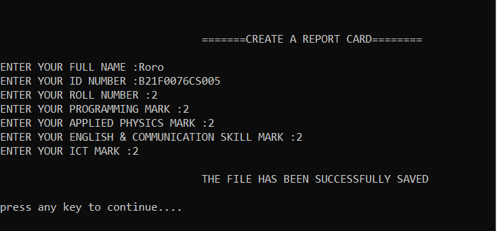

# Student Report Card Management System

A comprehensive C++ application designed to efficiently manage student records, including report cards, marks, and academic performance data.

## Features

- **Create Student Records**: Add new student report cards with detailed information
- **View All Records**: Display all student report cards in a structured format
- **Individual Record Access**: View specific student report cards by searching
- **Modify Records**: Update existing student information and marks
- **Performance Analysis**: Calculate total marks and averages for each student
- **Delete Records**: Remove student data when necessary
- **Search Functionality**: Quickly locate student records using roll numbers

## Objectives

This system aims to:
- Simplify administrative tasks for educational institutions
- Reduce time spent on student data management
- Provide direct access to students for viewing their academic records
- Enable efficient record modification and deletion by authorized personnel
- Offer comprehensive performance metrics including averages and totals

## Main Menu Options

1. **CREATE STUDENT REPORT CARD** - Add new student records
2. **VIEW ALL STUDENT REPORT CARDS** - Display complete student database
3. **VIEW A SINGLE STUDENT'S REPORT CARD** - Access individual records
4. **MODIFY A REPORT CARD** - Update existing student information
5. **RESULT** - Calculate and display total marks and averages
6. **DELETE RECORD** - Remove student records from the system

## Project Learnings

Through this project, we gained valuable experience in:

- **File Handling in C++**: Implementing persistent data storage and retrieval
- **Practical C++ Application**: Translating programming knowledge into functional software
- **Real-World Problem Solving**: Addressing actual administrative needs in educational settings
- **Collaborative Development**: Working effectively in a team environment
- **Software Design**: Creating user-friendly interfaces and efficient data structures

This project demonstrates the practical application of programming concepts to solve real-world problems in educational administration, while providing a solid foundation for further software development experience.

## Screenshots

Below are some screenshots demonstrating the functionality of the Student Report Card Management System:

### Main Menu

### Creating a Student Report Card

### Viewing All Student Records

### Viewing Individual Student Report

### Modifying Student Records

### Viewing Results

### Deleting Records

